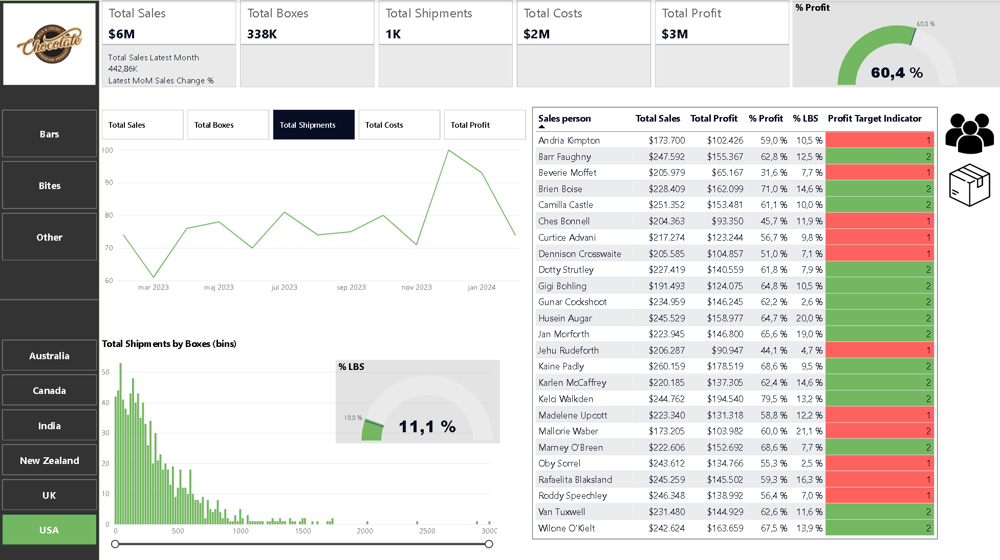

# 🍫 Sales & Performance Analysis (Power BI Dashboard)

## 📌 Project Overview
This project covers the development of an interactive, optimized Power BI dashboard for end-to-end monitoring of sales shipments, costs, profitability, and sales team performance. The development follows business analytics best practices: from clean data modeling and advanced DAX to thoughtful UX/UI design.



---

## 🏗️ 1. Data Modeling (Star Schema)
To ensure optimal performance and prevent data clutter, the model is organized using a **Star Schema**. This approach strictly separates data into two types of tables:

* **Fact table:** The center of the star is the main, largest table `shipments`. It contains the transactional numbers and events being measured (e.g., logging each purchase/shipment with its quantity and amounts).
* **Dimension tables:** The rays of the star, providing context and detail to those numbers (*Who? What? When? Where?*). Dedicated tables are used for customers (`people`), products (`products`), and dates (`calendar`).

---

## 📅 2. Time Management & Time Intelligence

### Official Date Table
In *Model View*, the `calendar` table is marked as **"Mark as Date Table"**. This step explicitly tells Power BI to use this table as the main reference source for all time-based calculations, preventing automatic generation of hidden date tables in the background and ensuring 100% accuracy of DAX time intelligence functions.

### Power Query (PQ) Transformations
The following descriptive columns were added to the `calendar` table in Power Query for granular filtering:
* `year`, `month`, `name of month`...
* **Important:** A dedicated `start of month` column was added, serving as the key foundation for advanced visual-level time calculations.

---

## 🧮 3. DAX Measures Development

All calculations are stored, for organizational purposes, in a dedicated empty table **`_Measures`** (created via the *Enter Data* button).

### Core measures:
* **Total Sales:** `SUM(shipments[Sales])` *(Format: Currency, no decimals)*
* **Total Boxes:** `SUM(shipments[Boxes])`
* **Total Shipments:** `COUNTROWS(shipments)`

### Cost and Profit Calculation (Row Context -> Aggregation):
1. First, a calculated column `Costs` was created in the shipments table, using `RELATED` to pull the cost per box from the products dimension table and multiplying it by the number of boxes in the shipment:
   $$\text{Costs} = \text{RELATED}(\text{products[Cost per box]}) \times \text{shipments[Boxes]}$$
2. **Total Costs:** `SUM(shipments[Costs])`
3. **Total Profit:** `[Total Sales] - [Total Costs]`

### LBS Analysis (Shipments with fewer than 50 boxes):
* **LBS Count:** `CALCULATE([Total Shipments], shipments[Boxes] < 50)`
* **% LBS:** `DIVIDE([LBS Count], [Total Shipments])`

### Time Comparison (Month-over-Month in tables):
* **Total Sales (prev month):** `CALCULATE([Total Sales], PREVIOUSMONTH('calendar'[Date]))`
* **MoM Sales Change %:**
    ```dax
    MoM Sales Change % = 
    VAR this_month = [Total Sales]
    VAR prev_month = [Total Sales (prev month)]
    RETURN DIVIDE(this_month - prev_month, prev_month)
    ```

---

## 🎨 4. Page Design & Advanced Visualizations

### Canvas Settings
The default page size (1280 x 720 px) was upgraded via *Format -> Canvas Settings* to standard Full HD resolution **1920 x 1080 px** for better clarity and a more professional layout.

### Solving Filter Context at the KPI Card Level (*Reference Labels*)
Since standard time intelligence measures don't work correctly on standalone cards due to the lack of a monthly row context, the logic was built using three advanced measures that dynamically isolate the latest available month:
1. **Latest Date:** `LASTDATE('calendar'[Start of Month])`
2. **Total Sales Latest Month:**
    ```dax
    Total Sales Latest Month = 
    VAR ld = [Latest Date]
    RETURN CALCULATE([Total Sales], 'calendar'[Start of Month] = ld)
    ```
3. **Latest MoM Sales Change %:** (Used as a *Reference label* under the main KPI):
    ```dax
    Latest MoM Sales Change % = 
    VAR ld = [Latest Date]
    VAR this_month_sales = [Total Sales Latest Month]
    VAR prev_month_sales = CALCULATE([Total Sales], 'calendar'[Start of Month] = EDATE(ld, -1))
    RETURN DIVIDE(this_month_sales - prev_month_sales, prev_month_sales)
    ```
* **Conditional Formatting:** The value inside the *Reference label* is dynamically colored **red** if the growth rate is below 0, and **green** if it is above 0.

### Visual Elements:
* **Gauge chart:** Implemented to display `% Profit`, formatted to match the overall design.
* **Dynamic Trend Analysis (Field Parameter):** Instead of five separate charts, a single line chart was created. Via *Modeling -> New Parameter -> Fields*, a parameter named **`Measure Selector`** was created. The date is placed on the X-axis and `Measure Selector` on the Y-axis, allowing users to dynamically switch between displayed metrics within a single visual.
* **Shipment Size Distribution Histogram:** Built using grouping/binning on the `Boxes` field. The X-axis shows `bins (boxes)` and the Y-axis shows `Total Shipments`. A *Zoom slider* was added to interactively adjust the X-axis range.

---

## 🔄 5. Advanced UX Interaction with Table Switching (Bookmarks)

To maximize use of space, the sales person table and the product table were placed directly on top of each other, with the user switching between them by clicking on icons (`people` and `product`).

### Technical Implementation via Bookmarks:
1. **Sales Target Indicator:** The sales person table implements logic to track whether a profitability target is met:
   `Profit Target Indicator = IF([% Profit] > [Profit Target], 2, 1)`
2. Using the **Selection** and **Bookmarks** panes (*View* tab), all elements (both tables and both icons) were precisely named.
3. **Bookmark 1 (Sales Table):** Product table hidden, sales person table visible. Bookmark saved.
4. **Bookmark 2 (Product Table):** Sales person table hidden, product table visible. Bookmark saved.
5. The bookmarks were assigned to the icons via *Format -> Action -> Bookmark*.
* ⚠️ **Critical note for correct functionality:** Since bookmarks save data state (current filters) by default, the **"Data" checkbox was manually unchecked** for both bookmarks. This ensures that switching between tables only changes the visual shown, while all currently selected report filters remain untouched.

---

## 🚀 How to Run the Project?
1. Download the `.pbix` file from this repository.
2. Open it with **Power BI Desktop**.
